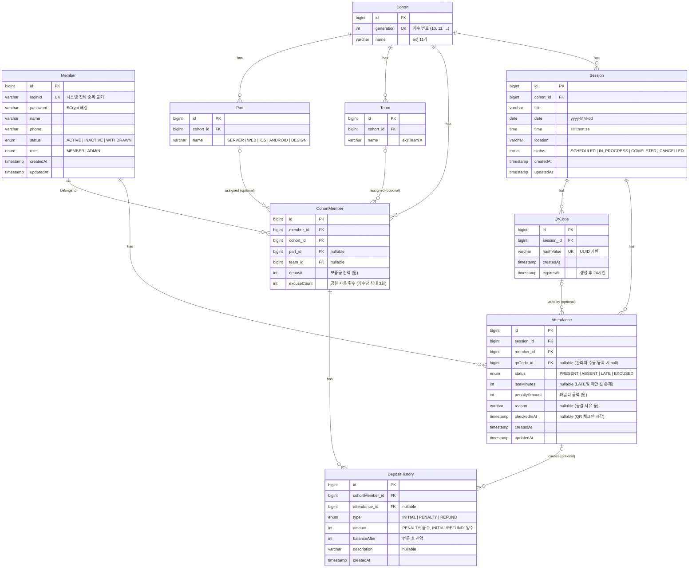

# ERD — 프로그라피 출결 관리 시스템

## 다이어그램

---

## 설계 결정 사항

### Member ↔ Cohort 다대다 → CohortMember 중간 테이블

한 회원이 여러 기수에 걸쳐 활동할 수 있으므로 CohortMember 테이블로 분리했습니다.
CohortMember는 단순 연결 테이블이 아니라 `deposit`, `excuseCount` 등 **기수별 독립 데이터**를 보유합니다.

### Part/Team → Cohort 직접 귀속

파트와 팀은 기수마다 새로 구성됩니다. 따라서 `cohort_id`를 FK로 갖고, CohortMember에서 Part/Team을 optional로 참조합니다.

### QrCode.hashValue → UUID

UUID 기반으로 생성하여 추측 불가능하고 시스템 전체에서 유일성이 보장됩니다.

### Attendance.qrCode_id → nullable

QR 체크인(자동)과 관리자 수동 등록 두 경로를 하나의 테이블에서 처리합니다.
QR 경로면 qrCode_id에 값이 있고, 관리자 수동 등록이면 null입니다.

### DepositHistory.amount 부호 규칙

| type    | amount  | 예시        |
|---------|---------|-------------|
| INITIAL | 양수    | +100,000    |
| PENALTY | 음수    | -10,000     |
| REFUND  | 양수    | +10,000     |

`balanceAfter`에 변동 후 실제 잔액을 기록하여 이력만으로도 잔액 추적이 가능합니다.
