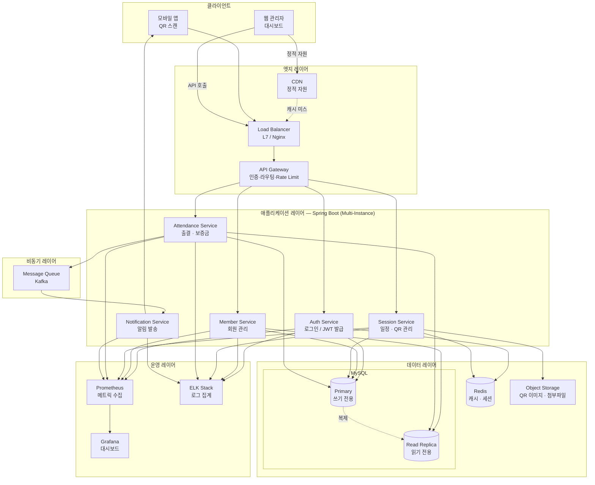

# System Design Architecture — 프로그라피 출결 관리 시스템

## 현재 구현 vs 이상적 아키텍처

| 항목 | 현재 구현 | 이상적 아키텍처 |
|------|---------|--------------|
| DB | H2 인메모리 | MySQL (Primary + Read Replica) |
| 캐싱 | 없음 | Redis |
| 인증 | 없음 (모든 API 공개) | JWT 기반 |
| 배포 | 단일 JVM | Container (Docker + Kubernetes) |
| 비동기 처리 | 없음 | Message Queue (Kafka) |
| 모니터링 | 없음 | Prometheus + Grafana |
| 로그 | 없음 | ELK Stack |

---

## 이상적 아키텍처 다이어그램



---

## 컴포넌트별 설계 의도

### 1. API Gateway

현재 구현에는 인증/인가가 없어 모든 API가 공개되어 있습니다. 이상적인 시스템에서는 API Gateway에서 다음을 처리합니다.

- **JWT 검증**: 모든 요청의 토큰을 중앙에서 검증, 서비스 내부에 인증 로직 중복 제거
- **Rate Limiting**: QR 체크인 엔드포인트 남용 방지 (동일 IP 초당 N회 제한)
- **라우팅**: `/admin/*` 경로는 ADMIN 역할 필수 검증 후 내부 서비스로 전달

---

### 2. MySQL — Primary / Read Replica 분리

현재 H2 인메모리 DB는 서버 재시작 시 모든 데이터가 소실됩니다.

| 경로 | 대상 쿼리 |
|------|---------|
| Primary (쓰기) | 출결 등록, 보증금 차감, 회원/일정 생성·수정 |
| Read Replica (읽기) | 회원 대시보드, 출결 이력 조회, 일정 목록 |

회원 대시보드(`GET /admin/members`)의 경우 현재 DB 쿼리 후 메모리 레벨 필터를 수행합니다. Read Replica 분리 후 **쿼리 레벨에서 generation/partName 필터를 지원**하는 복합 인덱스를 추가하면 메모리 후처리 없이 DB에서 직접 필터링 가능합니다.

---

### 3. Redis — 두 가지 용도

**① QR 코드 빠른 조회**

QR 체크인(`POST /attendances`) 경로는 현장에서 동시 다발적으로 발생합니다. 현재 구현은 `hashValue`로 DB를 직접 조회하는데, 이를 Redis에 캐싱하면 DB 부하를 크게 줄일 수 있습니다.

```
key:   qr:{hashValue}
value: { sessionId, expiresAt }
TTL:   QR 만료 시각까지
```

QR 갱신 시 기존 키를 삭제(invalidate)하고 새 QR 정보를 저장합니다.

**② JWT 블랙리스트 / 세션 관리**

로그아웃 또는 강제 만료가 필요한 JWT를 Redis에 블랙리스트로 관리합니다.

---

### 4. Kafka — 비동기 알림 처리

출결 체크인 시 회원에게 알림(푸시/이메일)을 보내는 요구가 생길 수 있습니다. 이를 동기적으로 처리하면 외부 알림 서비스 지연이 출결 API 응답 시간에 직접 영향을 줍니다.

```
체크인 처리 완료
    → Attendance Service가 Kafka에 AttendanceCheckedEvent 발행
    → Notification Service가 이벤트를 구독하여 푸시 알림 발송
```

Attendance Service와 Notification Service가 완전히 분리되므로 알림 서비스 장애가 출결 처리에 영향을 주지 않습니다.

---

### 5. Object Storage — QR 이미지

현재 구현은 QR의 `hashValue`(UUID 문자열)만 저장합니다. 실제 서비스에서는 QR 이미지 파일을 생성하여 Object Storage(S3 등)에 저장하고, 앱은 URL로 이미지를 내려받아 화면에 표시합니다.

```
QR 생성 요청
    → UUID hashValue 생성 → DB 저장
    → QR 이미지 생성 (ZXing 등) → Object Storage 업로드
    → 응답에 imageUrl 포함
```

---

### 6. 모니터링

| 도구 | 수집 대상 |
|------|---------|
| Prometheus | API 응답 시간, 에러율, JVM 메트릭, DB 커넥션 풀 |
| Grafana | 실시간 대시보드, 알림(체크인 급증, DB 응답 지연) |
| ELK Stack | 애플리케이션 로그, 예외 추적, 출결 이벤트 감사 로그 |

출결 관련 민감 이벤트(보증금 차감, 공결 등록 등)는 **감사 로그(Audit Log)** 로 별도 저장합니다.

---

## 현재 구현에서 이상적 아키텍처로의 단계적 전환

```
Phase 1 (현재)
└── 단일 Spring Boot + H2

Phase 2 (운영 안정화)
├── H2 → MySQL 전환 + Read Replica 분리
├── JWT 기반 인증 추가
└── Docker 컨테이너화

Phase 3 (트래픽 증가 대응)
├── Redis 캐싱 도입 (QR 조회 최적화)
├── API Gateway 도입 (Rate Limiting)
└── Kubernetes 배포 (오토스케일링)

Phase 4 (기능 확장)
├── Kafka 도입 (알림 비동기화)
├── Notification Service 분리
└── ELK + Prometheus/Grafana 운영 모니터링
```

각 단계는 독립적으로 적용 가능하며, 현재의 Controller → Service → Repository 레이어 구조를 유지하면 DB 교체나 캐싱 추가 시 서비스 로직 변경 없이 인프라 레이어만 수정하면 됩니다.
